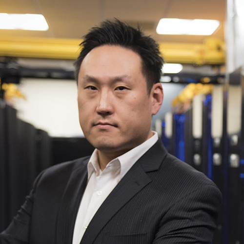
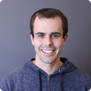

# Thursday, February 8th, 2024

## <a id="hf">Hal Finkel - _Keynote_ - The Department of Energy’s Advanced Scientific Computing Research Program: Recent Advances and Trends Motivating Future Research</a>

<!--**Abstract:** -->

**Biography:**
Hal is a program manager for computer-science research in the US Department of Energy (DOE) Office of Science’s Advanced Scientific Computing Research (ASCR) program and is currently the acting Division Director for ASCR’s Computational Science Research and Partnership division. Prior to joining ASCR, Hal was the Lead for Compiler Technology and Programming Languages at Argonne’s Leadership Computing Facility. He graduated from Yale University in 2011 with a Ph.D. in theoretical physics focusing on numerical simulation of early-universe cosmology.

## <a id="hf">Leon Song - ML Systems</a>

<!--**Abstract:** -->

**Biography:**
Shuaiwen Leon Song is part of Microsoft Deepspeed research group and manages the new Heterogenous Computing Architecture (HCA) group (e.g., Brainwave project). He leads Deepspeed4Science initiative (deepspeed4science.ai) and several other pathfinding projects related to LLMs. He is constantly exploring and exploiting opportunities to make Deepspeed the most efficient large-scale ML system acceleration framework in the world, focusing on producing cutting-edge system R&D that can benefits Azure and Bing users as well as making positive social impact by enabling sophisticated ML system designs for MSR AI4Science and WebXT/Bing 1P customers.

Shuaiwen has published over 85 refereed conference and journal articles. He also served as program track chair, organizing committee or program committee for leading HPC (e.g., Supercomputing) and computer architecture conferences (e.g., ASPLOS, ISCA, HPCA and MICRO). He is an ACM distinguished speaker.

## <a id="hf">Alexey Tumanov - ML Systems</a>

<!--**Abstract:** -->

**Biography:**
I've started as a tenure-track Assistant Professor in the School of Computer Science at Georgia Tech in August 2019, transitioning from my postdoc at the University of California Berkeley, where I worked with Ion Stoica and collaborated closely with Joseph Gonzalez. I completed my Ph.D. at Carnegie Mellon University, advised by Gregory Ganger. At Carnegie Mellon, I was honored by the prestigious NSERC Alexander Graham Bell Canada Graduate Scholarship (NSERC CGS-D3) and partially funded by the Intel Science and Technology Centre for Cloud Computing and Parallel Data Lab. Prior to Carnegie Mellon, I worked on agile stateful VM replication with para-virtualization at the University of Toronto, where I worked with Eyal de Lara and Michael Brudno. My interest in cloud computing, datacenter operating systems, and programming the cloud brought me to the University of Toronto from industry, where I had been developing cluster middleware for distributed datacenter resource management.

## <a id="hf">Greg Diamos - ML Systems</a>

<!--**Abstract:** -->

**Biography:**
Greg's mission is to build complex systems that the world can use.

He had previously co-founded MLPerf & MLCommons, which have now set the industry standards for high performance machine learning systems.

He had led the AI team at Baidu, where his team published the first paper on LLM scaling laws and invented Tensor Cores. He has nearly 14,000 citations on his research. At Baidu, he was also in charge of deploying one of the first LLMs into production to 100M people in 2009 into the Baidu search engine. The LLM is used by over 1 billion people today.

The team he led has now gone on to lead the development of nearly all the major foundation models we know today: OpenAI's GPT-3, GPT-4, and ChatGPT; Anthropic's Claude and Claude 2; Meta's Llama and Llama 2; NVIDIA's Megatron; and Google's PaLM.

In 2008, the very early days of deep learning, Greg was one of the original architects on CUDA — aka. a CUDA Ninja — at NVIDIA, where he contributed key inventions to the Volta GPU. He pioneered the earliest project in deep learning at NVIDIA (fun fact: AI wasn't cool then!), applying CUDA to neural networks for the first time.

He holds a PhD from the Georgia Institute of Technology in high-performance computing.

## <a id="hf">Vijay Reddi - ML Systems</a>

<!--**Abstract:** -->

**Biography:**
My research is centered on mobile and edge-centric computing systems with a rare taste for cloud computing aspects, mostly as it pertains to edge computing or my students' interests. I direct the Edge Computing Lab. I believe in solving computing problems, rather than associating myself with a particular domain or field of computing (i.e., hardware or software). I take great pride in that, and that reflects in my research groups' training. I generally publish in Computer Architecture, Robotics and ML venues.

## <a id="hf">Santosh Vempala - "Food for Thought"</a>

<!--**Abstract:** -->

**Biography:**
Santosh Vempala is Frederick Storey II Chair of Computing and Distinguished Professor in the School of Computer Science, with courtesy appointments in the schools of Mathematics and Industrial and Systems Engineering (ISyE). He served as the founding director of the Algorithms and Randomness Center and ThinkTank (2006-2011), and is currently the director of GT's oldest interdisciplinary PhD program --- Algorithms, Combinatorics and Optimization. His research interests include algorithms, randomness, high-dimensional geometry, brain and computing-for-good (C4G). He graduated from CMU in 1997 advised by Avrim Blum and was on the MIT faculty until 2007 except for a year as a Miller Fellow at UC Berkeley. Vempala is also a Sloan, Guggenheim, ACM, AMS and generally excitable Fellow, especially when a phenomenon that appears complex from one perspective turns out to be simple from another. In recent years, he has been trying to understand the limits of sampling and optimization algorithms and building a computational theory of brain.

## <a id="hf">Prasanna Balaprakash - Plenary Talk </a>

<!--**Abstract:** -->

**Biography:**
Since March 2023, I am leading Oak Ridge National Laboratory's  Artificial Intelligence Initiative, wherein I direct laboratory research, development and application of artificial intelligence and machine learning (AI/ML) to solve problems of national importance. I seek to deliver foundational, scalable, and applied AI/ML capabilities supporting Oak Ridge National Laboratory's broad mission and provide world-class solutions in computer and computational science, neutron science, materials science, biology and health science, nuclear engineering, isotopes, manufacturing, energy, and climate science.

My research interests span the areas of artificial intelligence, machine learning, optimization, and high-performance computing. My research focuses on the design and development of foundational and scalable data science algorithms to model and optimize complex systems in scientific and engineering domains

## <a id="hf">Josiah Hester - Extreme Low Power Computing</a>

<!--**Abstract:** -->

**Biography:**
I direct Ka Moamoa at Georgia Tech, a research lab exploring energy efficient computing in the context of global scale applications. We explore and develop new hardware designs, systems, interaction techniques, tools, and programming abstractions so that anyone can easily design, debug, and deploy tiny energy harvesting computers that work despite frequent power failures, constrained resources, and unpredictable conditions.

I work towards a sustainable future for computing informed by my Native Hawaiian (Kānaka Maoli) heritage. I apply my work in the field of intermittent computing to large-scale sensing for sustainability and conservation, health wearables, and interactive devices. My work is supported by multiple grants from the NSF, NIH, ARPA-H, DARPA, DoD, 3M, VMware, and the Sloan Foundation.

I was named a Sloan Fellow in Computer Science, won my NSF CAREER and a VMware Early Career Faculty Award in 2022. I was named to Popular Science’s Brilliant 10, the AISES Most Promising Scientist, and won a 3M Non-Tenured Faculty Award in 2021.

## <a id="hf">Azad Naeemi - Extreme Low Power Computing</a>

<!--**Abstract:** -->

**Biography:**
Professor Naeemi received his B.S. degree in electrical engineering from Sharif University, Tehran, Iran in 1994, and his M.S. and Ph.D. degrees in electrical and computer engineering from the Georgia Institute of Technology, Atlanta, Ga. in 2001 and 2003, respectively.

Prior to his graduate studies (from 1994 to 1999), he was a design engineer with Partban and Afratab Companies, both located in Tehran, Iran. He worked as a research engineer in the Microelectronics Research Center at Georgia Tech from 2004 to 2008 and joined the ECE faculty at Georgia Tech in fall 2008.

His research crosses the boundaries of materials, devices, circuits, and systems investigating integrated circuits based on conventional and emerging nanoelectronic and spintronic devices and interconnects. He is the recipient of the IEEE Electron Devices Society (EDS) Paul Rappaport Award for the best paper that appeared in IEEE Transactions on Electron Devices during 2007. He is also the first recipient of the IEEE Solid-State Circuits Society James D. Meindl Innovators Award (2022). He has received an NSF CAREER Award, an SRC Inventor Recognition Award, and several best paper awards at international conferences.

## <a id="hf">Jason Lowe-Power - Simulation and Testbeds</a>

<!--**Abstract:** -->

**Biography:**
Lowe-Power’s focus is hardware-software co-design to improve the efficiency and programmability of modern computer systems. As part of the Davis Computer Architecture Group, Lowe-Power investigates improving the efficiency and usability of heterogeneous systems, enhancing system security using hardware extensions and developing open source simulation methodology to support computer architecture research.

Lowe-Power is a Member of the ECE graduate group, and is Project management committee chair for the open source computer architecture simulator [gem5].

## <a id="hf">Jeffrey Young - Simulation and Testbeds</a>

<!--**Abstract:** -->

**Biography:**
Jeffrey (Jeff) Young is a research scientist in Georgia Tech's School of Computer Science. His main research interests include investigating scheduling and data movement for accelerators like GPU and Xeon Phi and working to model and map algorithms to high-performance architectures. He is currently working on a collaborative research program that is focused on mapping bandwidth-intensive algorithms to 3D stacked memories like Hybrid Memory Cube (HMC) and High Bandwidth Memory (HBM)  and on performing near-memory computation on devices like FPGAs and GPUs. He received his PhD in computer engineering in 2013 from Georgia Tech's ECE department.

## <a id="hf">Murali Emani -Simulation and Testbeds </a>

<!--**Abstract:** -->

**Biography:**
I am a Computer Scientist in the Artificial Intelligence and Machine Learning (AIML) group with the Argonne Leadership Computing Facility (ALCF) at Argonne National Laboratory. Prior, I was a Postdoctoral Research Staff Member at Lawrence Livermore National Laboratory, US. I obtained my PhD and worked as a Research Associate at the Institute for Computing Systems Architecture at the School of Informatics, University of Edinburgh, UK under the guidance of Prof. Michael O'Boyle. My research interests are in Parallel programming models, High Performance Computing, Scalable Machine Learning, Runtime Systems, Emerging HPC architectures, Online Adaptation. Some of my current projects include:

1. Developing performance models to identifying and addressing bottlenecks while scaling machine learning and deep learning frameworks on emerging supercomputers for scientific applications.
2. Co-design of emerging hardware architectures to scale up machine learning algorithms.
3. Efforts on benchmarking ML/DL frameworks and methods on HPC systems.
