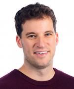

# Thursday, February 8th, 2024

## <a id="hf">Hal Finkel - _Keynote_ - The Department of Energy’s Advanced Scientific Computing Research Program: Recent Advances and Trends Motivating Future Research</a>

<!--**Abstract:** -->

**Biography:**
Hal is a program manager for computer-science research in the US Department of Energy (DOE) Office of Science’s Advanced Scientific Computing Research (ASCR) program and is currently the acting Division Director for ASCR’s Computational Science Research and Partnership division. Prior to joining ASCR, Hal was the Lead for Compiler Technology and Programming Languages at Argonne’s Leadership Computing Facility. He graduated from Yale University in 2011 with a Ph.D. in theoretical physics focusing on numerical simulation of early-universe cosmology.

## <a id="at">Alexey Tumanov - Serving Pareto Frontiers for Goodput-Sensitive Applications</a>

**Abstract:**
AI-powered applications increasingly operate in dynamically changing deployment scenarios, requiring optimizing for both accuracy and latency. Existing methods mainly target a single point in the accuracy/latency tradeoff space—insufficient as no single static point can be optimal under variable conditions. We refer to these inference-time variable conditions as dynamic deployment conditions. They are a challenge for ML-powered latency sensitive applications, because they can no longer rely on a single model architecture for a given prediction task. A fixed model induces a single point in the latency/accuracy/energy tradeoff space, which may be suboptimal when the model is queried with a very small or very permissive compute/latency budget. Intuitively, one size model no longer fits all. Instead we propose to use a different mechanism: multi-capacity ML models and address two sides of the equation: how do we train them and how do we serve such models in soft real-time. If time permits, we can also talk about inherent temporal locality induced by a stream of queries executed on weight shared multi-capacity models, and how we leverage this insight by introducing SubGraph Stationary optimizations that make real-time control decisions w.r.t which subgraphs to serve and cache as a function of dynamically variable inference-time conditions.

**Biography:**
Alexey Tumanov is an Assistant Professor of Computer Science at Georgia Tech. He directs a Systems for Artificial Intelligence Lab (SAIL). The research agenda of the lab builds around distributed systems support for soft real-time Machine Learning inference and training. Alexey holds a PhD from Carnegie Mellon where he developed an algebraic language for expressing arbitrary combinatorial soft constraints for heterogeneous space-time scheduling. As a graduate student at Carnegie Mellon Prof. Tumanov was a recipient of a highly selective NSERC (Canadian NSF) Alexander Graham Bell Canada Graduate Scholarship (CGS). As a Postdoctoral Fellow, he worked with Ion Stoica at UC Berkeley RiseLab, where his research focused on designing, architecting, and building several systems for Machine Learning, which became successful open source projects and startups. Alexey Tumanov is a recipient of the  Best Student Paper Award for his dissertation work published in EuroSys 2016 as well as the Test of Time award for the paper on ``Heterogeneity and Dynamicity of Clouds at Scale: Google Trace Analysis’’ at the ACM Symposium on Cloud Computing (SoCC’21).

## <a id="lh">Larry Heck - A Brief History of Large Language Models... and a glimpse into the future</a>

**Abstract:** 
With the very recent and broad awareness of Large Language Models (LLMs) across many disciplines and industries, there is a high level of excitement and expectation for the potential of this technology. As with any significant advance in technology, there is also the accompanying hype with overstatements of the capabilities of LLMs (e.g., reasoning, intelligence, emerging consciousness) as well as accompanying fear of what this advance represents in the broader AI story - fear of AI taking jobs, fear of AI misinformation, bias, undue influence on the political and economic processes, fear of unchecked autonomous AI, etc. In this talk, I will attempt to provide clarity on the reality of LLMs - a brief historical perspective on where they came from, what problems they were designed to solve, and what are their inherent limitations. I will discuss some of the more surprising capabilities that have emerged in LLMs, the potential of LLMs, and where the technology is going in the near future.

**Biography:** Larry Heck is a Professor in ECE and Interactive Computing, co-Head of the AI Hub and Machine Learning Center, Farmer Chair of Advanced Computing Concepts, and a GRA Eminent Scholar at the Georgia Institute of Technology. He is a Fellow of the IEEE, inducted into the Academy of Distinguished Engineers at Georgia Tech, and named a Distinguished Engineer at Texas Tech. After receiving the PhD EE from Georgia Tech, he joined SRI, followed by VP of R&D at Nuance, VP of Search and Advertising at Yahoo!, Chief Speech Scientist and Distinguished Engineer at Microsoft, Principal Scientist with Google Research, and CEO of Viv Labs and SVP at Samsung.

## <a id="mi">Michael Isaev - Calculon: a methodology and tool for high-level co-design of systems and large language models</a>

**Abstract:**
In this talk, we will examine Calculon, a parameterized analytical performance model of transformer-based Large Language Models (LLMs) for guiding high-level algorithm-architecture codesign studies. This model derives from an extensive survey of performance optimizations that have been proposed for the training and inference of LLMs; the model's parameters capture application characteristics, the hardware system, and the space of implementation strategies. With such a model, we can systematically explore a joint space of hardware and software configurations to identify optimal system designs under given constraints, like the total amount of system memory. Using Calculon, we have identified novel system designs that look significantly different from current inference and training systems, and we will discuss how this tool can help us to achieve higher efficiency, lower cost, and better scalability.

**Biography:**
Michael Isaev is a senior PhD student in the School of Computational Science and Engineering working with Dr. Richard Vuduc. His research interests include accelerating deep learning inference and training with a specific focus on using HPC techniques and algorithmic hardware and software co-design to create network accelerators for deep learning applications. 

## <a id="pl">Pan Li - Machine learning on Graphs -- system-friendly algorithm design</a>
**Abstract:**
Machine learning on graphs has found numerous applications across various domains, including social network analysis, recommendation systems, bioinformatics, and physics more. This talk is to present my group’s work on developing system-friendly algorithms for machine learning on graphs. Specifically, we will present a new algorithm pipeline named SUREL and its improved version SUREL+ for subgraph representation learning, which is known to be more expressive and behaves better than traditional graph neural networks in many tasks, such as link prediction, motif prediction, etc. The new framework achieves 50% performance boost in prediction accuracy compared with the traditional graph neural networks, and 5~20 times speed-up compared with the state-of-the-art subgraph representation learning pipeline

**Biography:** 
Pan Li has joined Georgia Tech's ECE department as an assistant professor  in Fall 2023, and he holds an adjunct position at Purdue's CS department. Pan's research interest lies broadly in the area of machine learning and optimization with graph data. His recent work includes algorithms and analysis for graph neural networks, hypergraph spectral methods, and their applications in physics and circuit design.  Pan Li's work has been recognized by several awards including the NSF Early Career Award, several industry research awards, and the Best Paper award at the 2022 Learning on Graphs conference.

## <a id="hf">Santosh Vempala - Emergent Computation and Learning in a Model of the Brain: from Neurons and Synapses to Memory and Cognition</a>

**Abstract:**
How does the mind (perception and cognition) arise from the brain (neurons and synapses)? We discuss a rigorous model of the brain that is consistent with basic principles of experimental neuroscience (inhibition, plasticity, homeostasis) and in which memorization, computation and learning are emergent phenomena --- consequences of exposure to sequences of stimuli.

**Biography:**
Santosh Vempala is Frederick Storey II Chair of Computing and Distinguished Professor in the School of Computer Science, with courtesy appointments in the schools of Mathematics and Industrial and Systems Engineering (ISyE). He served as the founding director of the Algorithms and Randomness Center and ThinkTank (2006-2011), and is currently the director of GT's oldest interdisciplinary PhD program --- Algorithms, Combinatorics and Optimization. His research interests include algorithms, randomness, high-dimensional geometry, brain and computing-for-good (C4G). He graduated from CMU in 1997 advised by Avrim Blum and was on the MIT faculty until 2007 except for a year as a Miller Fellow at UC Berkeley. Vempala is also a Sloan, Guggenheim, ACM, AMS and generally excitable Fellow, especially when a phenomenon that appears complex from one perspective turns out to be simple from another. In recent years, he has been trying to understand the limits of sampling and optimization algorithms and building a computational theory of brain.

## <a id="hf">Prasanna Balaprakash - Plenary Talk </a>

**Abstract:**
Heterogeneous nodes, many-core processors, and deep memory hierarchies, along with power and energy demands, make application and system management on existing and emerging high-performance computing (HPC) platforms an increasingly daunting task. Current application portability strategies are mostly static and are often based on a narrow set of workloads. Consequently, such a one-size-fits-all approach will render several existing, emerging, and future HPC platforms less performant for a wide range of scientific applications—a significant hurdle for data-intensive scientific discovery. In this talk, we will discuss the challenges associated with performance portability/tuning, data movement, and data storage in Department of Energy (DOE) leadership class HPC systems. We will present data-efficient machine learning methodologies that we have developed to effectively address some of these challenges. Finally, we will give a high-level overview of the DOE Frontiers in Artificial Intelligence for Science, Security, and Technology (FASST) initiative, which seeks to develop AI technologies for scientific and security applications through exascale and post-exascale leadership computing capabilities.

**Biography:**
Prasanna Balaprakash is the Director of AI Programs and Distinguished R&D Scientist at Oak Ridge National Laboratory, where he directs laboratory research, development and application of artificial intelligence and machine learning (AI/ML) to solve problems of national importance. His research interests span artificial intelligence, machine learning, optimization, and high-performance computing. He is a recipient of the U.S. Department of Energy's 2018 Early Career Award. Prior to joining Oak Ridge, he was a R&D lead and computer scientist at Argonne National Laboratory. He earned his Ph.D. from CoDE-IRIDIA at the Université Libre de Bruxelles in Brussels, Belgium, where he was a recipient of the European Commission's Marie Curie and Belgian F.R.S-FNRS Aspirant fellowships.

## <a id="hf">Josiah Hester - Extreme Low Power Computing</a>

**Abstract:**
For decades, smart devices (i.e., wireless sensing and computing systems) have relied primarily on battery power. Yet, batteries are bulky, expensive, high-maintenance, and unsustainable for the next trillion devices. Instead of relying on energy stored in a battery, the past decade has seen new approaches enabling battery-free, energy-harvesting smart devices. These devices compute intermittently, losing power, harvesting energy, restoring computational state, and finally continuing execution from the last checkpoint. This new paradigm has required rethinking programming models, operating systems, hardware and architecture design, tool creation, and evaluation techniques. In this talk, I will discuss the broad implications of what a battery-free, trillion-device IoT means, outline previous work on the topic, and then try to synthesize standard axioms and research frameworks from this work in the past decade– axioms that might guide (or be a starting point) for the next period of research in intermittent computing towards realizing a sustainable IoT.

**Biography:**
Josiah Hester is the Allchin Chair and Associate Professor of Interactive Computing and Computer Science at Georgia Tech. His work focuses on reimagining computing for sustainability, informed by his Kānaka Maoli heritage. Specifically, he investigates battery-free embedded systems and intermittent computing, with applications in health, conservation, agriculture, and interactive systems. Josiah was named a Sloan Fellow in Computer Science and won his NSF CAREER in 2022. His work has received multiple best paper awards and featured in the Wall Street Journal, Scientific American, BBC, Popular Science, Communications of the ACM, and the Guinness Book of World Records, among others.

## <a id="hf">Azad Naeemi - Novel Ternary Content Addressable Memory Designs Based on Emerging Magnetic and Magnetoelectric Devices</a>

**Abstract:**
Novel Ternary Content Addressable Memory Designs Based on Emerging Magnetic and Magnetoelectric Devices
 
With the ever-growing limits imposed by interconnects, novel computing paradigms that may reduce data traffic between logic and memory have become more attractive. Various in-memory computing approaches are therefore being explored for various applications/domains such as neural networks, associative memories, spin- torque nano-oscillators, probabilistic computing, and reservoir computing. Ternary content addressable memory (TCAM) is an associative memory that performs parallel data searches over a memory array and outputs if/where a match occurs. TCAMs have been used in a variety of applications, such as few-shot learning, DNA read alignment, deep random forest, and hyperdimensional computing. In this talk, compact TCAM cells with only a few transistors based on spin-orbit-torque and magnetoelectric devices are proposed and their potential performances are quantified using experimentally validated/calibrated physical models.

**Biography:**
Azad Naeemi is a professor in the School of Electrical and Computer Engineering at the Georgia Institute of Technology. His technical research crosses the boundaries of materials, devices, circuits, and systems, investigating integrated circuits based on conventional and emerging nanoscale devices and interconnects. His educational research includes experiential learning environments and their impact on conceptual understanding of scientific and engineering topics. He serves as the Editor-in-Chief of the IEEE Journal on Exploratory Computational Devices and Circuits (JXCDC) and is the Associate Director for Computation for the NSF-supported National Nanotechnology Coordinated Infrastructure (NNCI). He is a recipient of the IEEE Electron Devices Society (EDS) Paul Rappaport Award, the Inaugural IEEE Solid-State Circuits Society (SSCS) James Meindl Innovators Award, an NSF CAREER Award, an SRC Inventor Recognition Award, and several best paper awards from international conferences. 
 

## <a id="hf">Jason Lowe-Power - Leveraging the open-source ethos: How and why gem5 is being used to design the next generation of supercomputers</a>

**Abstract:**
Computer architecture simulation is a vital tool for designing and evaluating the next generation of supercomputers. However, simulation is not a trivial task, as it requires balancing accuracy, speed, flexibility, and scalability. In this talk, I discuss a case study in the success of an open-source community: the gem5 simulator which has been widely used and contributed by the computer architecture research community for over two decades. I will show how gem5 enables cutting-edge research and innovation in supercomputing by highlighting some recent work from my group. I will also discuss our ongoing work in modeling the next generation of supercomputers. Finally, I will talk about how to build a successful open-source community around a research tool and what has made gem5 such a success story.

**Biography:**
Jason Lowe-Power is an Associate Professor at University of California, Davis where he leads the Davis Computer Architecture Research Lab (DArchR). His research interests include optimizing data movement in heterogeneous systems, hardware support for security, and simulation infrastructure. Professor Lowe-Power is also the Chair of the Project Management Committee for the gem5 open-source simulation infrastructure. He received his PhD in 2017 from the University of Wisconsin, Madison, and received an NSF CAREER Award and a Google Research Scholar Award

## <a id="hf">Pan Li</a>

<!--**Abstract:** -->

**Biography:**
Pan Li has joined Georgia Tech. ECE department as an assistant professor since 2023 Fall, and holds an adjunct position at Purdue CS department. Pan's research interest lies broadly in the area of machine learning and optimization with graph data. His recent work includes algorithms and analysis for graph neural networks, hypergraph spectral methods, and their applications in physics and circuit design.  Pan Li's work has been recognized by several awards including NSF Early Career Award, several industry research awards, and the Best Paper award at the 2022 Learning on Graph conference.

## <a id="hf">Jeffrey Young - Novel Architecture Simulation, Emulation, and Evaluation with the CRNCH Rogues Gallery</a>

<!--**Abstract:** -->

**Biography:**
Jeffrey (Jeff) Young is a research scientist in Georgia Tech's School of Computer Science. His main research interests include investigating scheduling and data movement for accelerators like GPU and Xeon Phi and working to model and map algorithms to high-performance architectures. He is currently working on a collaborative research program that is focused on mapping bandwidth-intensive algorithms to 3D stacked memories like Hybrid Memory Cube (HMC) and High Bandwidth Memory (HBM)  and on performing near-memory computation on devices like FPGAs and GPUs. He received his PhD in computer engineering in 2013 from Georgia Tech's ECE department.

## <a id="hf">Murali Emani - Accelerating Scientific Machine Learning with AI Accelerators at ALCF AI Testbed </a>

<!--**Abstract:** -->

**Biography:**
I am a Computer Scientist in the Artificial Intelligence and Machine Learning (AIML) group with the Argonne Leadership Computing Facility (ALCF) at Argonne National Laboratory. Prior, I was a Postdoctoral Research Staff Member at Lawrence Livermore National Laboratory, US. I obtained my PhD and worked as a Research Associate at the Institute for Computing Systems Architecture at the School of Informatics, University of Edinburgh, UK under the guidance of Prof. Michael O'Boyle. My research interests are in Parallel programming models, High Performance Computing, Scalable Machine Learning, Runtime Systems, Emerging HPC architectures, Online Adaptation. Some of my current projects include:

1. Developing performance models to identifying and addressing bottlenecks while scaling machine learning and deep learning frameworks on emerging supercomputers for scientific applications.
2. Co-design of emerging hardware architectures to scale up machine learning algorithms.
3. Efforts on benchmarking ML/DL frameworks and methods on HPC systems.

# Friday, February 9th, 2024
## <a id="hf">Yiran Chen - Optimizing AI Systems through Cross-Layer Design: A Data-Centric Approach</a>

**Abstract:**
As artificial intelligence (AI) transforms various industries, state-of-the-art models have grown exponentially in size and capability. However, previous optimization efforts have primarily concentrated on computational aspects, often overlooking the significant bottleneck in AI system efficiency caused by the storage, retrieval, and orchestration of data. To address this challenge, we adopt a data-centric approach, performing collaborative optimization across the algorithms, systems, architecture, and circuit layers. In this presentation, we will first discuss the memory capacity and bandwidth bottleneck that has emerged with the advancement of AI models. Furthermore, we will present our optimization efforts aimed at addressing this bottleneck, which include compressing the AI model, tailoring the computation schedule, and customizing the memory hierarchy. Additionally, we explore the potential of compute-in-memory as a comprehensive solution to these challenges, presenting a holistic approach that integrates computation and memory for enhanced efficiency in AI systems. At the conclusion of our presentation, we will share our insights and vision for a data-centric approach to optimizing AI systems.

**Biography:**
Yiran Chen received B.S. (1998) and M.S. (2001) from Tsinghua University and Ph.D. (2005) from Purdue University. After five years in the industry, he joined the University of Pittsburgh in 2010 as Assistant Professor and was promoted to Associate Professor with tenure in 2014, holding Bicentennial Alumni Faculty Fellow. He is now the John Cocke Distinguished Professor of Electrical and Computer Engineering at Duke University and serving as the director of the NSF AI Institute for Edge Computing Leveraging the Next-generation Networks (Athena), the NSF Industry-University Cooperative Research Center (IUCRC) for Alternative Sustainable and Intelligent Computing (ASIC), and the co-director of Duke Center for Computational Evolutionary Intelligence (DCEI). His group focuses on the research of new memory and storage systems, machine learning and neuromorphic computing, and mobile computing systems. Dr. Chen has published 1 book and about 600 technical publications and has been granted 96 US patents. He has served as the associate editor of more than a dozen international academic periodicals and served on the technical and organization committees of about 70 international conferences. He is now serving as the Editor-in-Chief of the IEEE Circuits and Systems Magazine. He received 11 best paper awards, 1 best poster award, and 15 best paper nominations from international conferences and workshops. He received numerous awards for his technical contributions and professional services such as the IEEE CASS Charles A. Desoer Technical Achievement Award, the IEEE Computer Society Edward J. McCluskey Technical Achievement Award, etc. He has been the distinguished lecturer of IEEE CEDA and CAS. He is a Fellow of the AAAS, ACM, and IEEE, and now serves as the chair of ACM SIGDA.

## <a id="hf">Jennifer Hasler - A Vision for Neuromorphic Hardware Development Tools</a>

<!--**Abstract:** -->

**Biography:**
Rev. Dr. Jennifer Hasler received her B.S.E. and M.S. degrees in electrical engineering from Arizona State University in August 1991. She received her Ph.D. in computation and neural systems from California Institute of Technology in February 1997, and she received her Master of Divinity degree from the Candler School of Theology at Emory University in 2020. Her ordination service was held on December 17, 2021. 

Dr. Hasler is a professor at the Georgia Institute of Technology in the School of Electrical and Computer Engineering; Atlanta is the coldest climate in which Dr. Hasler has lived.

Dr. Hasler founded the Integrated Computational Electronics (ICE) laboratory at Georgia Tech, a laboratory affiliated with the Laboratories for Neural Engineering.

Dr. Hasler is a member of Tau Beta P, Eta Kappa Nu, and the IEEE.

## <a id="hf">Ben Feinberg - Where Is My Analog Accelerator?</a>

**Abstract:**
Over the past decade there has been a resurgence of interest in analog accelerators capitalizing on developments in dense, CMOS-compatible, and programmable non-volatile memories. Taking advantage of fundamental circuit properties to perform linear algebra calculations in the analog domain has the potential to avoid major data movement challenges in modern systems. Unfortunately, a decade on analog linear algebra accelerators still seem closer to academic research than real products. This talk will discuss some of the challenges and pitfalls in architecture research on analog accelerators which have contributed to the slow progress. Despite these challenges however, there have been significant advances in analog accelerators and the field is well positioned for architectural research. This talk will review some recent results showing the potential of analog accelerators for a range of applications including computer vision, signal processing, and optimization, and discuss important architecture research directions for analog accelerators.

**Biography:**
Ben Feinberg is a Senior Member of Technical Staff in the Scalable Computer Architecture Group at Sandia National Laboratories. His research focuses on architectures for autonomous system with an emphasis on analog accelerators. Dr. Feinberg leads architecture modeling and system software research for Sandia's Rad-Edge project, and is Sandia's lead architect for the DARPA OPTIMA program. He is one of the developers of CrossSim, and leads a project with DOE Vehicle Technology Office on compute requirements for autonomous vehicles. Prior to joining Sandia in 2019, Ben completed his PhD in Electrical Engineering at the University of Rochester

## <a id="hf">Spencer Bryngelson - Hybrid algorithm for incompressible flow simulation on quantum hardware</a>

**Abstract:** 
Partial differential equation (PDE) solvers for Navier-Stokes fluids problems are important for many science and engineering problems. Quantum algorithms have been verified to can solve linear PDEs and verified on simulators. Fault-tolerant quantum hardware may make exponential speedups possible for, for example via linearization methods and HHL-type linear solvers. Still, NISQ-era near-term quantum hardware requires algorithms that demand less quantum volume: shallower gate depths and fewer qubits. Variational algorithms, like VQE and VQLS, are appropriate under such restrictions. Here, we present work on a hybrid approach to solving the nonlinear incompressible Navier-Stokes equations. A classical computer performs the nonlinear computations and a quantum algorithm, on simulator or hardware, performs the cumbersome Poisson equation solve that enforces mass continuity. A lid-driven cavity flow problem is investigated to analyze sensitivity to variational parameters and quantum noise.

**Biography:**
Spencer Bryngelson is a tenure-track assistant professor in the College of Computing at Georgia Tech. Previously, he was a senior postdoctoral researcher at Caltech (with Professor Tim Colonius). He has been a visiting researcher at MIT (with Professor Themis Sapsis) and a postdoctoral researcher at the Center for Exascale Simulation of Plasma-Coupled Combustion (XPACC). He received his Ph.D. and M.S. in Theoretical and Applied Mechanics from the University of Illinois at Urbana–Champaign in 2017 and 2015, working with Professor Jonathan Freund. In 2013, he received B.S. degrees in both Mechanical Engineering and Mathematics from the University of Michigan–Dearborn.

## <a id="hf">Mathias Jacquelin - Multi-Dimensional Seismic Processing with Algebraic Compression on Cerebras CS-2 Systems</a>

<!-- **Abstract:** 
Partial differential equation (PDE) solvers for Navier-Stokes fluids problems are important for many science and engineering problems. Quantum algorithms have been verified to can solve linear PDEs and verified on simulators. Fault-tolerant quantum hardware may make exponential speedups possible for, for example via linearization methods and HHL-type linear solvers. Still, NISQ-era near-term quantum hardware requires algorithms that demand less quantum volume: shallower gate depths and fewer qubits. Variational algorithms, like VQE and VQLS, are appropriate under such restrictions. Here, we present work on a hybrid approach to solving the nonlinear incompressible Navier-Stokes equations. A classical computer performs the nonlinear computations and a quantum algorithm, on simulator or hardware, performs the cumbersome Poisson equation solve that enforces mass continuity. A lid-driven cavity flow problem is investigated to analyze sensitivity to variational parameters and quantum noise.
-->
**Biography:**
Mathias Jacquelin is a Senior Member of the Technical Staff at Cerebras Systems, focusing on parallel and distributed programming techniques for Machine Learning and High-Performance Computing applications. Before joining Cerebras, Mathias was a Research Staff Scientist at the Lawrence Berkeley National Laboratory, where he worked on task-based scheduling and lightweight one-sided communications in the context of sparse matrix direct solvers. He holds a PhD in Computer Science from the École Normale Supérieure de Lyon and an MSc in Information Technology from the Institut National des Sciences Appliquées de Lyon (INSA Lyon)., focusing on

Mathias has made various contributions to dense and sparse matrix and stencil computations. He received the 2017 Best Paper Award at the IXPUG workshop of the ISC HPC conference and the 2011 TCPP Best Poster award at the 25th International Parallel and Distributed Processing Symposium (IPDPS’11).

<!-- ## <a id="hf">Larry Heck - Emerging Applications</a>

**Abstract:** 
With the very recent and broad awareness of Large Language Models (LLMs) across many disciplines and industries, there is a high level of excitement and expectation for the potential of this technology. As with any significant advance in technology, there is also the accompanying hype with overstatements of the capabilities of LLMs (e.g., reasoning, intelligence, emerging consciousness) as well as accompanying fear of what this advance represents in the broader AI story - fear of AI taking jobs, fear of AI misinformation, bias, undue influence on the political and economic processes, fear of unchecked autonomous AI, etc. In this talk, I will attempt to provide clarity on the reality of LLMs - a brief historical perspective on where they came from, what problems they were designed to solve, and what are their inherent limitations. I will discuss some of the more surprising capabilities that have emerged in LLMs, the potential of LLMs, and where the technology is going in the near future.

**Biography:**
Larry Heck is a Professor in ECE and Interactive Computing, co-Head of the AI Hub and Machine Learning Center, Farmer Chair of Advanced Computing Concepts, and a GRA Eminent Scholar at the Georgia Institute of Technology. He is a Fellow of the IEEE, inducted into the Academy of Distinguished Engineers at Georgia Tech, and named a Distinguished Engineer at Texas Tech. After receiving the PhD EE from Georgia Tech, he joined SRI, followed by VP of R&D at Nuance, VP of Search and Advertising at Yahoo!, Chief Speech Scientist and Distinguished Engineer at Microsoft, Principal Scientist with Google Research, and CEO of Viv Labs and SVP at Samsung.-->

## <a id="hf">Roberto Gioiosa - Hardware Accelerators: Use, Misuse, and Co-Design</a>

<!--**Abstract:** -->

**Biography:**
Dr. Roberto Gioiosa is a senior research scientist and team lead at the Pacific Northwest National Laboratory (PNNL) in the High-Performance Computing Group. His research interests include operating systems and runtimes, high-performance computer architectures, memory, and networks, parallel and distributed programming models, resilience, performance and power modeling and analysis, and embedded systems.

Dr. Gioiosa earned his Ph.D. in 2006 from the University of Rome "Tor Vergara", Rome Italy. He has worked at the Los Alamos National Laboratory (LANL) (2004-2005), the Barcelona Supercomputing Center (BSC) (2006-2008 and 2009-2012), the IBM T.J. Watson Research Center (2008-2009) where he contributed to the development of the Compute Node Kernel for BG/Q systems, and Oak Ridge National Laboratory (ORNL) (2017-2018).

Currently, his projects include the development of system software for extremely heterogeneous systems, system software for scalable distributed systems, , DSSoC design, evaluation of emerging architecture and technologies for exascale systems and applications, and development of operating systems for exascale systems. He is a member of the ACM and IEEE Computer Society.

## <a id="hf">Bahar Asgari - Exploiting Diversity in Sparse Problems to Enable Efficient Computing</a>

<!--**Abstract:** -->

**Biography:**
Bahar Asgari is an assistant professor in the Department of Computer Science at the University of Maryland, College Park (UMD), with a joint appointment at UMIACS and an affiliation with ECE department. Prior to UMD, she spent a year on Google's Systems and Services Infrastructure team, focusing on improving the performance of Google's systems and establishing strategies to balance various trade-offs, particularly in optimizing memory utilization, cost, and reliability. Asgari earned her Ph.D. in electrical and computer engineering from Georgia Tech in 2021. During her PhD, she was selected as a Rising Star in EECS in 2019 . Asgari’s doctoral dissertation, in consultation with her advisors Prof. Yalamanchili and Prof. Kim, focuses on efficiently improving the performance of sparse problems. Asgari is a recipient of the DoE Early Career Award 2023.
